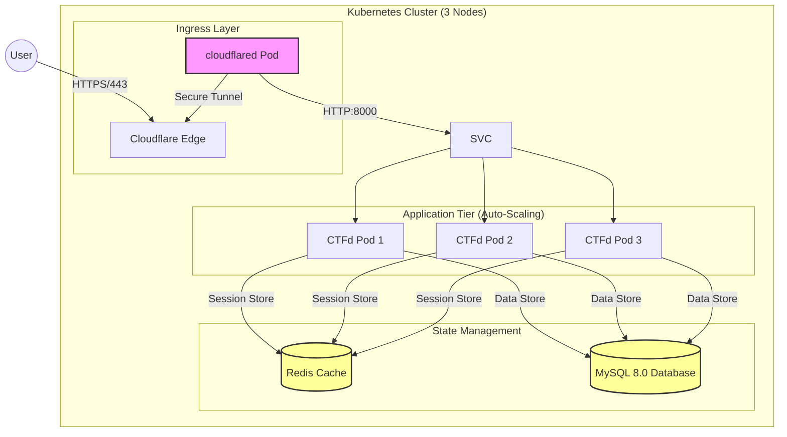

# CTFd Kubernetes DevSecOps Deployment

This repository contains a production-grade, highly available Kubernetes orchestration for [CTFd](https://ctfd.io/), optimized for a **3-Node Cluster** (High Performance).

## 🏗️ Architecture Visualization

The architecture is designed for **High Availability (HA)** and **Zero-Trust Security** using Cloudflare Tunnels.



---

## 🚀 Phase 1: Infrastructure Prerequisites

**Hardware Requirements (Per Node):**
*   **Provider:** Linode (or any VPS provider)
*   **Count:** 3 Nodes
*   **Spec:** 8 GB RAM, 4 vCPU
*   **OS:** Ubuntu 22.04 LTS (Recommended)

### 1.1 Automated Host Setup (Run on ALL Nodes)
We have provided a script to automate the installation of Containerd and Kubernetes tools.

1.  Upload `setup.sh` to all 3 nodes.
2.  Run it:
    ```bash
    chmod +x setup.sh
    sudo ./setup.sh
    ```

---

## 🛠️ Phase 2: Kubernetes Installation

### 2.1 Initialize Cluster (Control Plane Only)
Run this **only** on the first node.

```bash
sudo kubeadm init --pod-network-cidr=10.244.0.0/16
```

1.  Copy the `mkdir`, `cp`, and `chown` commands output by the init script to set up your kubeconfig.
2.  Copy the `kubeadm join ...` command provided at the end.

### 2.2 Install Network Plugin (Control Plane Only)
We use Flannel for the pod network.
```bash
kubectl apply -f https://github.com/flannel-io/flannel/releases/latest/download/kube-flannel.yml
```

### 2.3 Join Workers
Run the `kubeadm join ...` command (copied from step 2.1) on the **other 2 nodes**.

---

## 📦 Phase 3: Application Deployment

### 3.1 Namespace & Auto-Generate Secrets
We have a script to automatically generate strong passwords for MySQL and CTFd, and inject them into the YAML files.

```bash
# 1. Create Namespace
kubectl create namespace ctfd

# 2. Run the secret generator (Run this LOCALY or on the Control Plane)
chmod +x configure_secrets.sh
./configure_secrets.sh
```

### 3.2 Cloudflare Tunnel Setup
1.  Go to Cloudflare Zero Trust Dashboard -> Networks -> Tunnels.
2.  Create a Tunnel, choose "Docker".
3.  Copy the token.
4.  Edit `cloudflared.yaml` and replace `<TOKEN>`:
    ```bash
nano cloudflared.yaml
    ```
5.  Apply the configuration:
    ```bash
kubectl apply -f cloudflared.yaml
    ```

### 3.3 Deploy Core Components
Deploy the optimized manifests.

```bash
# 1. State Layer (Database & Cache)
kubectl apply -f mysql-pvc.yaml
kubectl apply -f mysql-configmap.yaml
kubectl apply -f mysql-deployment.yaml
kubectl apply -f mysql-service.yaml

kubectl apply -f redis-deployment.yaml
kubectl apply -f redis-service.yaml

# 2. Application Layer
kubectl apply -f ctfd-configmap.yaml
kubectl apply -f ctfd-deployment.yaml
kubectl apply -f ctfd-service.yaml

# 3. Autoscaling
kubectl apply -f ctfd-hpa.yaml
```

---

## ⚙️ Resource Optimizations (Based on 8GB/4vCPU Nodes)

We have tuned the resource limits to utilize the 24GB Total RAM / 12 Total Cores capacity of the cluster.

| Component | Requests (Guaranteed) | Limits (Hard Cap) | Reasoning |
| :--- | :--- | :--- | :--- |
| **MySQL** | **1 CPU / 2Gi RAM** | **2 CPU / 4Gi RAM** | Database performance relies on RAM caching. Using `Recreate` strategy to prevent locking. |
| **CTFd** | **0.5 CPU / 512Mi RAM** | **1 CPU / 1Gi RAM** | Workers scale from 3 to 10 replicas based on load. 1 Pod per node minimum. |
| **Redis** | **0.25 CPU / 256Mi RAM** | **0.5 CPU / 512Mi RAM** | High throughput for session handling across multiple CTFd pods. |

## 🧪 Verification

Check the status of all components:
```bash
kubectl get all -n ctfd
```

*   **Pods:** Should show 3/3 CTFd, 1/1 MySQL, 1/1 Redis, 1/1 Cloudflared running.
*   **MySQL:** Ensure logs say "ready for connections".
*   **HPA:** Ensure autoscaler targets are initialized.

## 🐛 Troubleshooting

**Issue:** `[InnoDB] Unable to lock ./ibdata1 error: 11`
*   **Cause:** Two MySQL pods running simultaneously during an update.
*   **Fix:** The `mysql-deployment.yaml` is set to `strategy: Recreate`. If stuck, delete the old pod: `kubectl delete pod <old-mysql-pod> -n ctfd`.

**Issue:** CSRF/Session Errors on Login
*   **Cause:** User connects to Pod A, submits to Pod B, session not found.
*   **Fix:** Ensure Redis is running and `REDIS_URL` is set in `ctfd-configmap.yaml`.